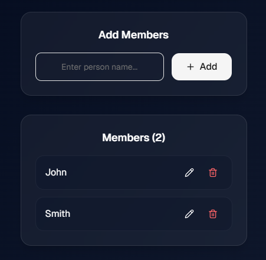
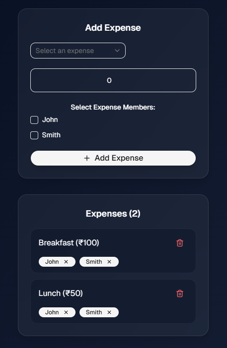
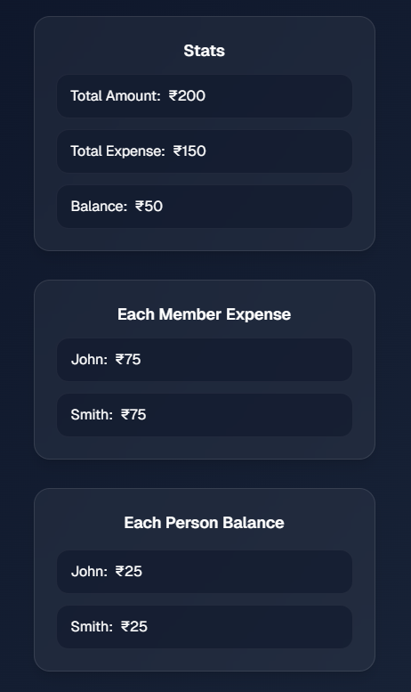

# 💰 Trip Expense Calculator

A modern Trip Expense Calculator built with **React**, **TypeScript**, **Vite**, and **shadcn/ui** to manage shared trip expenses, meals, and participant-based balance calculations.

This app helps groups split expenses smartly by allowing users to add members, create multiple expenses, assign participants for each expense, and calculate individual spending and balances in real time.

---

## 🚀 Features

- 👥 Add, edit, and remove trip members
- 💵 Set per person budget
- 🍽️ Add multiple expenses/meals
- 👤 Participant-based expense splitting
- ❌ Remove participants from an expense
- 📊 Individual member expense calculation
- ⚖️ Real-time balance tracking
- 🎨 Modern UI with shadcn/ui + Tailwind CSS
- 📱 Responsive design

---

## 📁 Project Structure

- 📁 src
  - 📁 components       # Reusable UI components
  - 📁 context          # Expense context and provider
  - 📁 lib              # Utility functions
-
- 📄 App.tsx           # Main app component
- 📄 main.tsx          # App entry point
- 📄 package.json
- 📄 tsconfig.json
- 📄 vite.config.ts
- 📄 README.md

---

## 🛠️ Tech Stack

- **Frontend**: React.js
- **Language**: TypeScript
- **Build Tool**: Vite
- **Styling**: Tailwind CSS
- **UI Components**: shadcn/ui
- **Icons**: Lucide React
- **State Management**: React Context API

---

## ⚙️ Installation

1. **Clone the repository**
   ```bash
   git clone https://github.com/moheebk123/trip-expense-calculator.git
   cd trip-expense-calculator
   ```

2. **Install dependencies**
   ```bash
   npm install
   ```

3. **Run development server**
   ```bash
   npm run dev
   ```

4. **Build project**
   ```bash
   npm run build
   ```

---

## ✨ Screenshots

- **Person Budget**


- **Members Management**


- **Expense Management**


- **Balance Summary**


---

## 🧠 Core Logic

- Each expense is divided only among selected participants
- Individual expense is calculated by:

  ```text
  expense amount / number of participants
  ```

- Total member balance:

  ```text
  total paid - total expense
  ```

---

## 🔮 Future Improvements

- 💳 Track who paid each expense
- 🔄 Settlement suggestions (who owes whom)
- 📤 Export trip summary
- 🌙 Dark/Light mode toggle
- ☁️ Database persistence

---

## 🧑 Author

Developed with ❤️ by **Moheeb Khan**

---